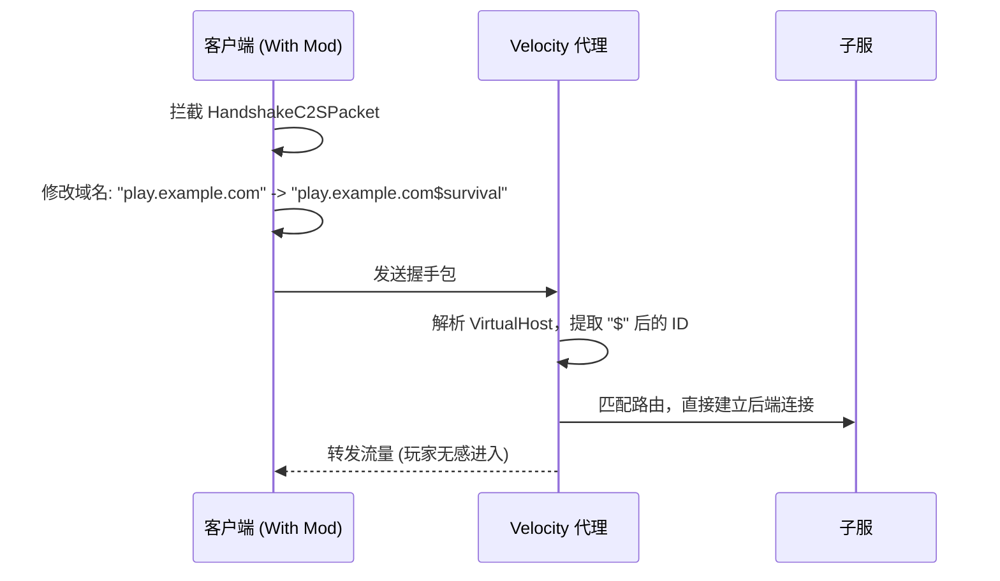

# ⚡ ServerSwitcher

[](https://www.oracle.com/java/technologies/downloads/)
[](https://velocitypowered.com/)
[](https://fabricmc.net/)
[](https://files.minecraftforge.net/)
[](https://www.architectury.dev/)

> 无需大厅，无需等待。基于握手包篡改的 Minecraft 极速分流方案。

## 📖 简介

**ServerSwitcher** 是一个由 **客户端模组** 和 **Velocity 插件** 组成的轻量级解决方案。

**ServerSwitcher** 通过在 TCP 握手阶段注入自定义 Payload，让 Velocity 在建立连接前就能识别目标服务器，实现**0延迟直连**。

## 🛠 工作原理

Minecraft 协议的握手包包含一个 `Server Address` 字段。本项目利用 Mixin 拦截该数据包，将模组包 ID 附加在域名之后。



## ✨ 特性

* 🚀 **零延迟直连**：跳过 Lobby，连接即入服。
* 🔧 **极简配置**：只需配置 ID 与目标服务器的映射关系。
* 📦 **整合包友好**：专为大型模组包分发设计。

## 📦 安装

### 客户端

1. 下载对应版本的模组 `.jar` 文件。
2. 放入整合包的 `mods` 文件夹中。
3. 在 `ServerSwitcher.jar/assets/serverswitcher/switcher.properties` 中配置自定义 ID。

### 服务端 (Velocity)

1. 将插件放入 Velocity 的 `plugins` 文件夹。
2. 启动代理服务器以生成配置文件。

## ⚙️ 配置

在 Velocity 的 `plugins/velocityswitcher/config.yml` 中配置路由映射：

```yaml
# 格式: "客户端发来的KEY": "Velocity中注册的服务器名称"
servers:
  lobby: "Lobby"
  survival: "Survival"
  creative: "Creative"
  skyblock: "SkyBlock"
```

## 🤝 贡献

欢迎提交 Issue 或 Pull Request！

## 📄 开源协议

本项目采用 [MIT License](LICENSE) 开源许可。
